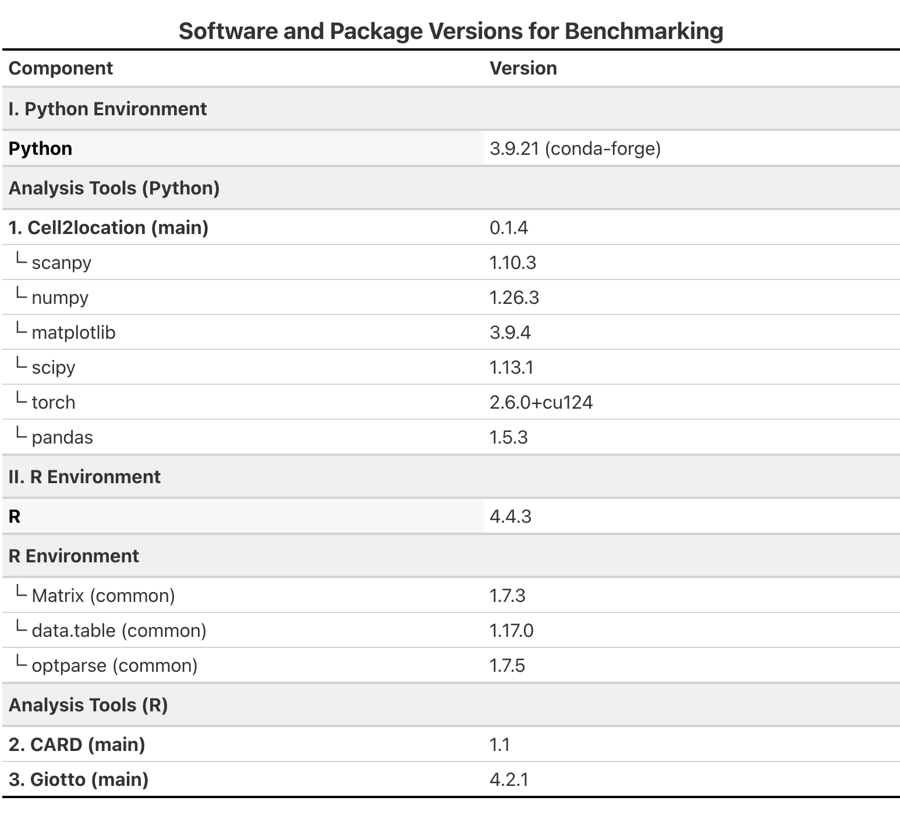

# Code for: Comprehensive Benchmark on Spatial Transcriptomic Deconvolution Methods: SpatialDWLS, CARD, and Cell2Location

This repository contains the Python and R scripts used to perform the benchmarking analysis, run deconvolution tools, process data, and generate visualizations for the study: "Comprehensive Benchmark on Spatial Transcriptomic Deconvolution Methods: SpatialDWLS, CARD, and Cell2Location".


**Data Repository:** [https://github.com/AnonymityICAuser/CMML3_ICA2_data](https://github.com/AnonymityICAuser/CMML3_ICA2_data)

## Overview

The scripts in this repository facilitate:
1.  **Data Preprocessing:** Preparing real and simulated spatial transcriptomics (ST) and single-cell RNA-seq (scRNA-seq) data for deconvolution.
2.  **Simulation Generation:** Creating simulated ST datasets with known ground truth cell type proportions from imaging-based data (e.g., MERFISH, seqFISH+).
3.  **Running Deconvolution Tools:** Executing Cell2location, CARD, and SpatialDWLS on the prepared datasets.
4.  **Batch Processing:** An example bash script (`run_deconvolution_real.bash`) is provided to automate the execution of all three deconvolution tools across multiple (simulated) datasets.
5.  **Evaluation:** Calculating performance metrics (e.g., RMSE, JSD, PCC) by comparing predicted proportions to ground truth (for simulations) or assessing intrinsic metrics.
6.  **Visualization:** Generating figures and plots presented in the paper.

---

## Repository Structure

```
/
├── Evaluation& Visualization/ # Scripts for evaluating results and generating plots
│ ├── bechmark_script_real.py
│ └── visualization.py
├── Helper_scripts/ # Utility scripts for data processing and simulation
│ ├── convert_csv_to_adata.py
│ ├── preprocess_adatas.py
│ ├── simulation_deconvolution.py
│ └── split_adata.py
├── README.md # This file
├── Tool_run/ # Scripts to run each deconvolution tool
│ ├── run_CARD.r
│ ├── run_cell2loc.py
│ ├── run_spatalDWLS.r
│ └── run_spatialDWLS_withclus.r
├── img/ # Images used in this README or paper figures
│ ├── Benchmark_overview.pdf
│ └── Version_figure.png
└── run_deconvolution_real.bash # Example Bash script for batch job submission
```

---

## Prerequisites and Setup

### 1. Software
*   **Python:** Version 3.9.21 (as used in the study).
*   **R:** Version 4.4.3 (as used in the study).

(See `img/Version_figure.png` below or Supplementary Figure S3 of the paper for a detailed list of package versions.)

### 2. Environment Setup
We recommend creating Conda environments to manage dependencies. The `run_deconvolution_real.bash` script assumes Conda environments named `cell2loc_env` (for Python tools) and `r_env` (for R tools). The specific package versions used in our study are detailed below:


*(This figure corresponds to Supplementary Figure S3 in the paper.)*

**Links for packages:**
You could check the documents for Cell2Location, CARD, and Giotto (SpatialDWLS API) 

For Cell2location:
![https://cell2location.readthedocs.io/en/latest/index.html][https://cell2location.readthedocs.io/en/latest/index.html]


For CARD:
![github.com/YMa-lab/CARD/][github.com/YMa-lab/CARD/]

For Giotto:
![https://drieslab.github.io/Giotto_website/][https://drieslab.github.io/Giotto_website/]

And SpatialDWLS API:
![https://drieslab.github.io/Giotto_website/articles/deconvolution.html][https://drieslab.github.io/Giotto_website/articles/deconvolution.html]

## 3. Data

Download or clone the Data Repository: https://github.com/AnonymityICAuser/CMML3_ICA2_data.

The scripts, especially run_deconvolution_real.bash, expect input data (AnnData files, CSVs) to be structured in specific locations. You will need to define the paths to your datasets within the bash script (e.g., DATA_ROOT_DIR, ST_H5AD_FILES, SC_H5AD_FILES, etc.) or adapt the script to your data structure.

## Workflow Overview

The general workflow for benchmarking is as follows (visualized in img/Benchmark_overview.pdf, corresponding to Figure 1a in the main paper):


- Prepare Data (using Helper_scripts/):

- For real datasets: Preprocess raw gene expression matrices and scRNA-seq references (preprocess_adatas.py). Convert formats if necessary (convert_csv_to_adata.py).

- For simulated datasets: Generate simulated ST data from high-resolution imaging data (simulation_deconvolution.py), controlling for parameters like spot resolution or gene numbers. Populate the arrays in run_deconvolution_real.bash with paths to these simulated data files.


- Batch Processing (Recommended for multiple simulated datasets): Configure and run run_deconvolution_real.bash. This script will iterate through your specified datasets and execute Cell2location, CARD, and SpatialDWLS sequentially for each.


- Evaluate and Visualize Results (using Evaluation& Visualization/):Use bechmark_script_real.py (or similar scripts for simulated data) to calculate performance metrics from the output proportion matrices. Use visualization.py to generate plots and figures based on the calculated metrics and proportion matrices.


## Example of running codes
#### Example for Cell2location (ensure cell2loc_env is active or use conda run)
```
python Tool_run/run_cell2loc.py \
    --adata_ref /path/to/your/sc_reference.h5ad \
    --adata_decon /path/to/your/spatial_data.h5ad \
    --output_csv /path/to/your/output/cell2loc_proportions.csv
```

#### Example for CARD (ensure r_env is active or use conda run)
```
Rscript Tool_run/run_CARD.r \
    --st_dir /path/to/your/ST_R_data_directory/ \
    --sc_dir /path/to/your/SC_R_data_directory/ \
    --cell_type_file /path/to/your/SC_R_data_directory/cellinfo.csv \
    --output /path/to/your/output/CARD_proportions.csv
```

#### Example for SpatialDWLS
```
conda run -n r_env Rscript "${SCRIPT_BASE_DIR}/deconv/run_spatalDWLS.r" \
    --st_dir /path/to/your/ST_R_data_directory/ \
    --sc_dir /path/to/your/SC_R_data_directory/ \
    --cell_type_file /path/to/your/SC_R_data_directory/cellinfo.csv \
    --output /path/to/your/output/CARD_proportions.csv
```

